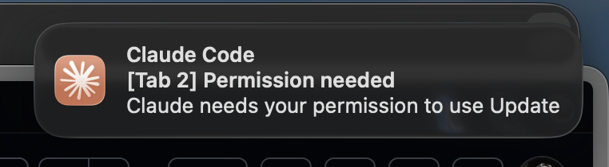
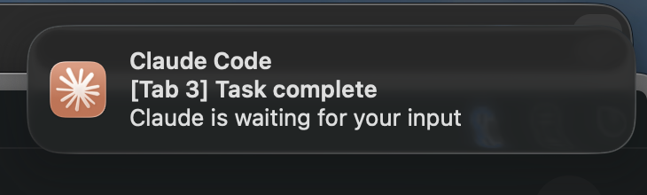

# ClaudeCodeNotifier

Native macOS desktop notifications for [Claude Code](https://docs.anthropic.com/en/docs/claude-code). Get alerted when Claude needs your attention — no more staring at the terminal.




## What it does

ClaudeCodeNotifier hooks into Claude Code's notification system and sends native macOS notifications whenever Claude requires a handoff from you:

- **Permission required** — Claude needs your approval to run a tool (Bash, file edits, etc.)
- **Task complete** — Claude has finished working and is waiting for your input
- **Input needed** — Claude has a question and needs your response
- **Any other event** — Catches all notification types Claude Code may send

Each notification shows which **Ghostty terminal tab** triggered it, so you can jump straight to the right session.

## Features

- Native macOS notifications with custom Claude icon
- Full Ghostty terminal support — notifications show `[Tab 3]` so you know exactly where to look
- Falls back to project directory name for other terminals
- Fast bash hook — no Node.js or TypeScript overhead
- Works globally across all projects
- Handles all Claude Code notification events

## Requirements

- macOS
- [Claude Code](https://docs.anthropic.com/en/docs/claude-code)
- [jq](https://jqlang.github.io/jq/) (`brew install jq`)
- Xcode Command Line Tools (`xcode-select --install`)
- [Ghostty](https://ghostty.org/) terminal (full support with tab detection)

## Installation

```bash
git clone https://github.com/kovoor/ClaudeCodeNotifier.git
cd ClaudeCodeNotifier
./install.sh
```

The install script will:
1. Build the native macOS app from source
2. Install it to `~/.claude/ClaudeCodeNotifier.app`
3. Install the notification hook to `~/.claude/hooks/`
4. Configure `~/.claude/settings.json`

### Post-install

1. **Allow notifications** — When prompted, allow notifications for "Claude Code Notifier" in System Settings > Notifications
2. **Ghostty accessibility** (optional) — For tab detection, grant Ghostty access in System Settings > Privacy & Security > Accessibility
3. **Restart Claude Code** for hooks to take effect

### Manual configuration

If you already have a `~/.claude/settings.json`, add the hooks config:

```json
{
  "hooks": {
    "Notification": [
      {
        "matcher": "",
        "hooks": [
          {
            "type": "command",
            "command": "~/.claude/hooks/notification-desktop.sh",
            "timeout": 10
          }
        ]
      }
    ]
  }
}
```

## How Ghostty tab detection works

ClaudeCodeNotifier uses a TTY marker technique to identify which Ghostty tab triggered the notification:

1. Traces the process tree to find the shell's TTY
2. Temporarily sets the tab title to a unique marker via ANSI escape sequences
3. Uses AppleScript to scan Ghostty's tab bar and find which tab has the marker
4. Restores the original tab title

This happens in ~50ms and is invisible to the user. If Ghostty isn't detected or accessibility isn't enabled, it falls back to showing the project directory name.

## Terminal support

| Terminal | Status | Tab detection |
|----------|--------|---------------|
| Ghostty  | Full support | Tab number via TTY marker |
| Others   | Basic support | Falls back to project name |

## Roadmap

- [ ] Click notification to focus the correct Ghostty tab
- [ ] Support for more terminals (iTerm2, Warp, Kitty, Alacritty)
- [ ] OpenAI Codex support
- [ ] Windows support
- [ ] Linux support
- [ ] iOS companion app for remote notifications

## License

MIT
