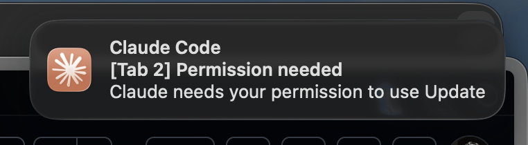
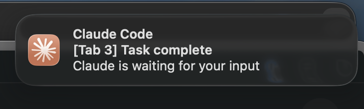

# ClaudeCodeNotifier

Native macOS desktop notifications for [Claude Code](https://docs.anthropic.com/en/docs/claude-code) and [OpenCode](https://opencode.ai). Get alerted when your agent needs your attention — no more staring at the terminal.

<p align="center">
  
  
</p>

## What it does

ClaudeCodeNotifier hooks into your coding agent's notification system and sends native macOS notifications whenever it requires a handoff from you:

- **Permission required** — agent needs your approval to run a tool (Bash, file edits, etc.)
- **Task complete** — agent has finished working and is waiting for your input
- **Input needed** — agent has a question and needs your response
- **Any other event** — catches all notification types the agent may send

Each notification shows which **terminal tab** or **project directory** triggered it, so you can jump straight to the right session. Claude and OpenCode each get their own notifier bundle, so the banner icon matches the agent that fired it.

## Features

- Native macOS notifications for both Claude Code and OpenCode
- Per-agent branding — each agent has its own app bundle and icon, so macOS shows the right logo on the banner
- Ghostty tab detection — notifications show `[Tab 3]` so you know exactly where to look
- Falls back to project directory name for other terminals
- Fast bash hook for Claude Code; lightweight JS plugin for OpenCode
- Works globally across all projects
- Handles all notification events

## Requirements

- macOS
- [Claude Code](https://docs.anthropic.com/en/docs/claude-code) and/or [OpenCode](https://opencode.ai)
- [jq](https://jqlang.github.io/jq/) (`brew install jq`) — required for the Claude Code hook
- [OpenCode.app](https://opencode.ai) at `/Applications/OpenCode.app` — the OpenCode icon is extracted from its bundle at install time (optional; without it OpenCode notifications fall back to the Claude icon)
- Terminal of your choice (currently best supported with [Ghostty](https://ghostty.org/))

## Quick install

```bash
curl -fsSL https://raw.githubusercontent.com/kovoor/ClaudeCodeNotifier/main/install-quick.sh | bash
```

This downloads the pre-built app and configures everything automatically.

## Install from source

Requires Xcode Command Line Tools (`xcode-select --install`).

```bash
git clone https://github.com/kovoor/ClaudeCodeNotifier.git
cd ClaudeCodeNotifier
./install.sh
```

## Post-install

1. **Allow notifications** — When prompted, allow notifications for "Claude Code Notifier" in System Settings > Notifications
2. **Ghostty accessibility** *(optional)* — For tab detection, grant Ghostty access in System Settings > Privacy & Security > Accessibility
3. **Restart Claude Code and OpenCode** for the new hook/plugin to take effect

### Manual configuration

If you already have a `~/.claude/settings.json`, merge the hooks config:

```json
{
  "hooks": {
    "Notification": [
      {
        "matcher": "",
        "hooks": [
          {
            "type": "command",
            "command": "~/.claude/hooks/notification-desktop.sh",
            "timeout": 10
          }
        ]
      }
    ]
  }
}
```

### OpenCode plugin

The installer builds a second app bundle — `OpenCodeNotifier.app` — at `~/.claude/OpenCodeNotifier.app`, using the icon pulled from your local `/Applications/OpenCode.app`. It also drops `opencode-notifier.js` into `~/.config/opencode/plugins/`, which OpenCode auto-loads at startup — no additional config required. The plugin fires banners on:

- **`permission.ask`** — OpenCode wants to run a tool and needs your approval
- **`session.idle`** — OpenCode finished a task and is waiting (only fires after a busy state, to avoid startup noise)
- **`session.error`** — something went wrong

Subagent (child session) idles are suppressed, so you only hear from the root session. If `/Applications/OpenCode.app` is missing at install time, the OpenCode bundle is skipped — install OpenCode and rerun the installer.

## How Ghostty tab detection works

ClaudeCodeNotifier uses a TTY marker technique to identify which Ghostty tab triggered the notification:

1. Traces the process tree to find the shell's TTY
2. Temporarily sets the tab title to a unique marker via ANSI escape sequences
3. Uses AppleScript to scan Ghostty's tab bar and find which tab has the marker
4. Restores the original tab title

This happens in ~50ms and is invisible to the user. If Ghostty isn't detected or accessibility isn't enabled, it falls back to showing the project directory name.

## Terminal support

| Terminal | Status | Tab detection |
|----------|--------|---------------|
| Ghostty  | Full support | Tab number via TTY marker |
| Others   | Basic support | Falls back to project name |

## Roadmap

- [x] OpenCode support
- [ ] Click notification to focus the correct Ghostty tab
- [ ] Support for more terminals (iTerm2, Warp, Kitty, Alacritty)
- [ ] OpenAI Codex support
- [ ] Windows support
- [ ] Linux support
- [ ] iOS companion app for remote notifications

## License

MIT
